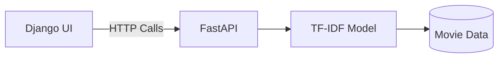

---

```markdown
# 🎬 Movie Recommendation Engine

**Multi-interface** recommendation system with:
- Django web UI (new!)
- FastAPI backend
- Streamlit interactive demo

[](https://movie-recommender-khzw.onrender.com/docs)  


## 🚀 Features
| Component       | Technology | Access Point |
|----------------|------------|--------------|
| Web UI         | Django     | `/`          |
| API Backend    | FastAPI    | `/api/docs`  |
| Data Explorer  | Streamlit  | `/app`       |

## 🛠️ Tech Stack
- **Backend**: FastAPI + TF-IDF/Cosine Similarity
- **Web UI**: Django 5
- **Data Tools**: Pandas, scikit-learn
- **Deployment**: Render (Django), Streamlit Cloud

## 🏗️ Project Structure
```
movie-recommender/
├── api.py               # FastAPI endpoints
├── app.py               # Streamlit UI
├── django_ui/           # Django project root
│   ├── settings.py
│   └── urls.py
├── recommender/         # Django app
│   ├── templates/       # HTML files
│   └── views.py         # Connects to FastAPI
└── requirements.txt     # Unified dependencies
```

## 🖥️ How to Run
### Option 1: Django Web UI
```bash
python manage.py runserver  # http://localhost:8000
```

### Option 2: FastAPI Backend
```bash
uvicorn api:app --reload  # http://localhost:8001
```

### Option 3: Streamlit
```bash
streamlit run app.py  # http://localhost:8501
```

## 🌐 Deployment
1. **Django UI**: Update `render.yaml` to use:
   ```yaml
   startCommand: "python manage.py runserver --host 0.0.0.0 --port 8000"
   ```
2. **Streamlit**: Deploy via [Streamlit Cloud](https://streamlit.io/cloud)

## 🔄 Workflow


## 📜 License
MIT
```

---

### Key Updates:
1. **Added Django** as first-class interface
2. **Clear table** showing access points
3. **Visual workflow** diagram (MermaidJS)
4. **Kept all existing** functionality (FastAPI/Streamlit)

### Social Media Snippet:
> 🎥 Just upgraded my movie recommender with a @Django web UI!  
> - Reuses my existing FastAPI backend  
> - Preserves Streamlit for quick demos  
> - All in one repo 🔄  
>  
> Code: [https://github.com/saida25/movie-recommender] #Python #Django #AI  


