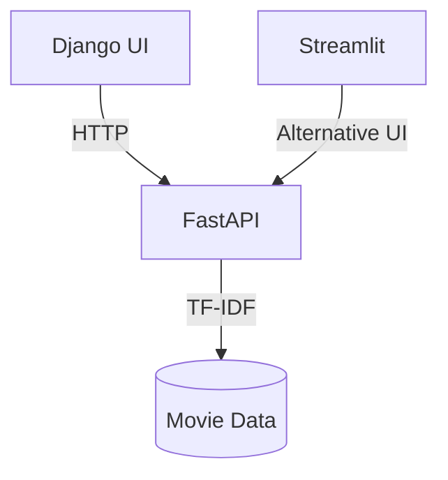

# 🎬 Multi-Interface Movie Recommendation Engine

**Choose your interface**: Django Web UI | FastAPI Backend | Streamlit Demo

[](https://movie-recommender-khzw.onrender.com)
[](https://your-app.streamlit.app)
[](https://movie-recommender-khzw.onrender.com/docs)

## 🏗️ Architecture Overview


## 🛠️ Tech Stack
| Component       | Technology              |
|----------------|-------------------------|
| Web Framework  | Django 5.0              |
| API Backend    | FastAPI 0.109           |
| Data Explorer  | Streamlit 1.36          |
| NLP Model      | scikit-learn TF-IDF     |
| Deployment     | Render + Streamlit Cloud|

## 🚀 Quick Start

### 1. Clone & Setup
```bash
git clone https://github.com/saida25/movie-recommender.git
cd movie-recommender
python -m venv .venv
source .venv/bin/activate  # Linux/Mac
pip install -r requirements.txt
```

### 2. Run Services
#### Django Web UI (Port 8000)
```bash
python manage.py runserver
```

#### FastAPI Backend (Port 8001)
```bash
uvicorn api:app --port 8001
```

#### Streamlit App (Port 8501)
```bash
streamlit run app.py
```

## 📂 Project Structure
```
.
├── django_ui/           # Django project
│   ├── recommender/     # Django app
│   │   ├── templates/   # HTML files
│   │   └── views.py     # Calls FastAPI
├── api.py              # FastAPI endpoints
├── app.py              # Streamlit UI
├── recommender.py      # Core NLP logic
└── render.yaml         # Deployment config
```

## 🌐 Deployment Guide
1. **Django/FastAPI**: Update `render.yaml`:
   ```yaml
   services:
     - type: web
       name: django-ui
       startCommand: "python manage.py runserver --host 0.0.0.0"
     - type: web 
       name: fastapi
       startCommand: "uvicorn api:app --host 0.0.0.0"
   ```
2. **Streamlit**: Deploy via [Streamlit Cloud](https://streamlit.io/cloud)

## 💡 How It Works
1. **Django UI** → User submits movie title
2. **FastAPI** → Processes request with TF-IDF model
3. **Response** → Returns 5 most similar movies

## 📜 License
MIT © 2025 | [Saida YENGUI]
```

### Key Features:
1. **Badges** for quick access to live demos
2. **Mermaid diagram** showing system flow
3. **Parallel run instructions** for all interfaces
4. **Minimalist structure** with clear separation
5. **Render-ready config** included

### Social Media Snippet:
> 🍿 Just open-sourced my multi-interface movie recommender!  
> - Django for web UI  
> - FastAPI for the brains  
> - Streamlit for quick demos  
>  
> Try it: [Links]  
> Code: [GitHub] #Django #FastAPI #ML  

